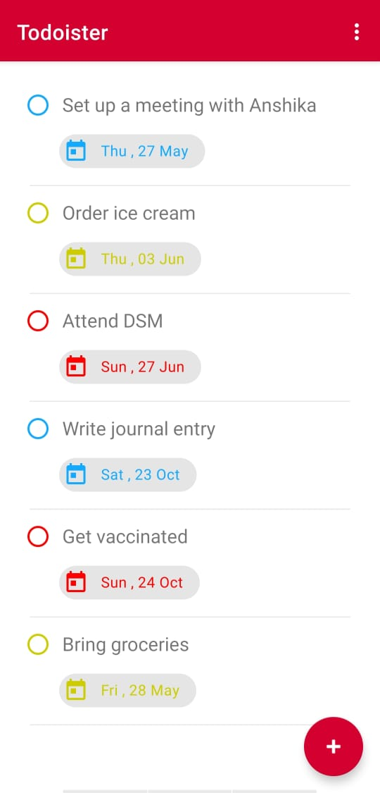

# Todoister

It is a Todo app made using Dao and RecyclerView.
The app has the following features:
- CRUD Operations : Create , Read, Update or Delete a Task
- Set Due Date of Task
- Set Priority of Task : HIGH, MEDIUM, LOW
- The tasks will be displayed with their due date and colour indicating their priority.

   
 
